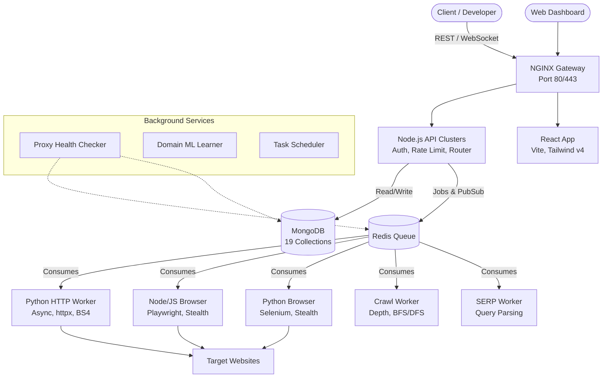

<div align="center">
  
  <h1>ScrapeForge</h1>
  <p><b>The most comprehensive, commercial-grade Web Scraping & Data Intelligence Platform.</b></p>

  <p>
    
    
    
    
  </p>
</div>

---

ScrapeForge combines adaptive stealth, JS rendering, proxy rotation, SERP scraping, and deep site crawling — all behind a single unified API and a powerful React dashboard.

## ✨ Key Features

- **🌐 Unified API** - Scrape, crawl, extract, and search through one RESTFUL gateway.
- **🛡️ Adaptive Stealth Engine** - Bypasses anti-bots via TLS mimicry, CAPTCHA solving, behavioral simulation, and automatic proxy rotation (Datacenter, Residential, Mobile).
- **🛠️ Rule-Based Extraction** - Extract structured data using CSS selectors, XPath, and Regex.
- **⚡ High-Performance Architecture** - Queue-based distributed architecture running Node.js and Python workers processing 1000s of concurrent jobs.
- **🕸️ Deep Site Crawling** - Automated discovery, pagination handling, and sitemap parsing.
- **📊 Real-time Dashboard** - Monitor credit usage, success rates, worker latency, and job statuses via real-time WebSockets.
- **🔍 SERP Scraping** - Built-in multi-engine search scraping (Google, Bing, DuckDuckGo, Yahoo, etc.).

## 🏗️ Architecture Stack

ScrapeForge is designed for high concurrency and resilience using a microservice-oriented architecture deployed via Docker.



## 🚀 Quick Start

### Option 1: 1-Click Heroku Deploy

The easiest way to get a live version of ScrapeForge running is to deploy the pre-configured `heroku` branch directly to Heroku.

[](https://heroku.com/deploy?template=https://github.com/adarshkr357/ScrapeForge/tree/heroku)

*Note: You must have a MongoDB Atlas connection string ready to provide during setup.*

### Option 2: Docker Compose (Recommended)

Get the entire 15-container stack running with a single command. 

```bash
# 1. Clone the repository
git clone https://github.com/adarshkr357/ScrapeForge.git
cd ScrapeForge

# 2. Configure Environment
cp .env.example .env
# Edit .env with your specific keys (API keys, secrets, etc.)

# 3. Build, Start & Seed Database
make start
```

### Option 3: Local Development Setup

If you want to run the core systems locally without Docker:

```bash
# 1. Start required infrastructure (MongoDB + Redis)
docker-compose up -d mongodb redis

# 2. Install dependencies
cd api && npm install
cd ../dashboard && npm install
cd ../workers/node-browser && npm install

# 3. Seed demo data (Demo user, Proxies, Domains)
cd api && node src/seed.js

# 4. Start API, Dashboard, and Workers (in separate terminals)
cd api && npm run dev
cd dashboard && npm run dev
cd workers/node-browser && npm run start
```

### 🔑 Default Credentials

After running the seed script, log into the dashboard at `http://localhost:8080`:
- **Email:** `demo@scrapeforge.io`
- **Password:** `DemoPass123!`

---

## 📖 API Reference

Interact with the API programmatically using your API key.

### Authentication
Include your API Key or JWT in the request headers:
```http
X-API-Key: sf_demo_YOUR_API_KEY
```

### Core Endpoints

| Method | Endpoint | Description | Credit Cost |
|--------|----------|-------------|-------------|
| `POST` | `/api/v1/scrape` | Single URL scrape with options | 1-25 |
| `POST` | `/api/v1/scrape/batch` | Batch scrape (up to 5,000 URLs) | per-URL |
| `GET`  | `/api/v1/scrape/:id` | Poll async result status | 0 |
| `POST` | `/api/v1/crawl` | Start broad site crawl job | per-page |
| `POST` | `/api/v1/search` | SERP scrape (7 engines) | 5 |
| `POST` | `/api/v1/extract` | Rule-based HTML extraction | 5 |

### Scrape Example

```bash
curl -X POST http://localhost:3000/api/v1/scrape \
  -H "X-API-Key: YOUR_API_KEY" \
  -H "Content-Type: application/json" \
  -d '{
    "url": "https://news.ycombinator.com",
    "render_js": false,
    "output_format": "markdown",
    "stealth_mode": "adaptive",
    "extraction_rules": {
      "titles": { "selector": ".titleline a", "type": "array" }
    }
  }'
```

---

## ⚙️ Environment Configuration

Refer to `.env.example` in the root directory for a full list of configuration parameters.

### Critical Variables
| Variable | Description | Default |
|----------|-------------|---------|
| `MONGO_URI` | Connection string for MongoDB | `mongodb://mongo:27017/scrapeforge` |
| `REDIS_HOST` | Redis host for BullMQ and Caching | `redis` |
| `JWT_SECRET` | Secret key for JWT signatures | *(Requires manual setup)* |
| `OPENAI_API_KEY` | Optional. Enables LLM-based extraction | empty |
| `TWO_CAPTCHA_API_KEY`| Optional. Automated CAPTCHA solving | empty |

---

## 📁 Project Structure

```text
ScrapeForge/
├── api/                      # Node.js Express Gateway
│   ├── src/models/           # Mongoose schemas (User, Request, Result, etc.)
│   ├── src/routes/           # API Endpoints
│   ├── src/queue/            # BullMQ producer implementation
│   └── src/websocket/        # Real-time stats emitter
├── workers/                  # Specialized execution workers
│   ├── python/               # Http, Browser, Crawl, SERP workers
│   └── node-browser/         # Playwright workers
├── dashboard/                # React Vite Dashboard
│   ├── src/pages/            # UI Views (ScrapeHistory, UsageBilling, SerpSearch, ProxyChecker, etc.)
│   └── src/components/       # Reusable UI Elements
├── services/                 # Background cron/standalone services
│   ├── proxy-checker/        # Validates proxy IP health
│   └── domain-learner/       # ML bot defense recognition
└── docker-compose.yml        # Orchestration (15 interlinked services)
```

---

## 📄 License & Access

**Proprietary Software**. All rights reserved. 
This project is currently available for private usage, enterprise hosting, or internal deployments only. 
